# RadarZone 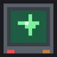 - Minecraft Mod

**Proximity radars for Minecraft.** Detect players inside a configurable perimeter and alert your allies remotely — wherever they are.

---

## Overview

RadarZone adds a small network of surveillance devices to the game. Place a radar, define the area it watches, whitelist the players you trust, and you will know the moment someone else walks in — even if you are on the other side of the world, as long as you carry a Radar Tablet.

The radar also emits a redstone pulse on detection, so it plugs straight into your existing contraptions: doors, alarms, traps or dispensers. A transponder lets you decide *which* detections are worth a signal.

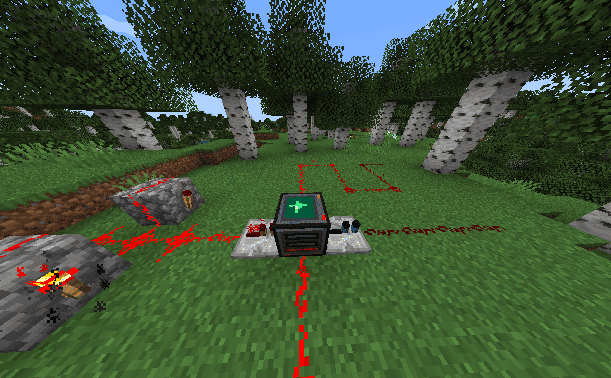

## Features

- **Configurable perimeter** — set the size of the watched area on each radar, up to a limit defined in the mod config.
- **Ally whitelist** — allied players get access to the radar and are never flagged as hostile.
- **Remote alerts** — sound and on-screen text as soon as a hostile player enters a radar you have access to.
- **Redstone integration** — radars are triggered by redstone pulses and emit a pulse on detection.
- **Signal filtering** — the transponder filters the radar output by ally, enemy, or both.
- **Named zones** — every radar has a name, so alerts and lists stay readable.

## Blocks and items

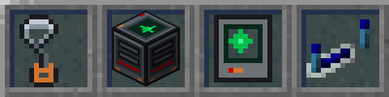

| Item | Description |
| --- | --- |
| **Radar Antenna** | Crafting component. |
| **Radar** | The proximity radar block. |
| **Radar Tablet** | Lets you check your radars and receive alerts while it is in your inventory. |
| **Radar Transponder** | Filters the redstone signal generated by the radar. |

## How it works

### Radar

The radar needs a **redstone pulse** to scan its perimeter, and it **emits a redstone pulse** when it detects players inside it.

Its GUI lets you configure:

- **Name** — to identify the area at a glance when browsing your radars or reading an alert.
- **Perimeter size** — set per radar. The maximum allowed size is **50×50** by default and can be changed in the mod's configuration files.
- **Allied players** — allies get access to the radar and are not marked as hostile when they enter the perimeter.

  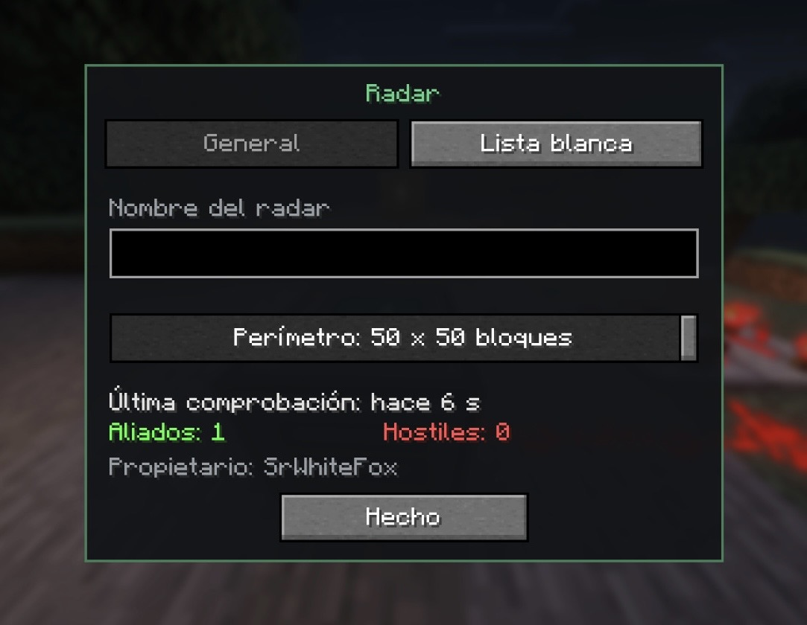
  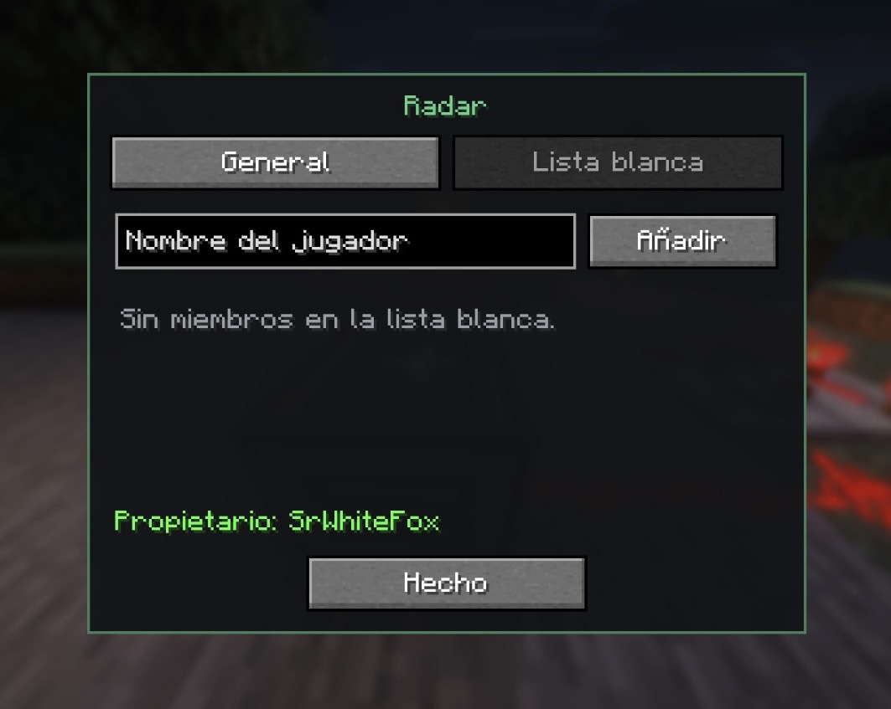

### Radar Tablet

Carry it in your inventory and you will:

- **Receive alerts** (sound and on-screen text) whenever a hostile player enters the range of a radar you have access to.
- **Open its GUI** to review your radars: hostile players inside the perimeter, allied players, time since the last scan, and more.

  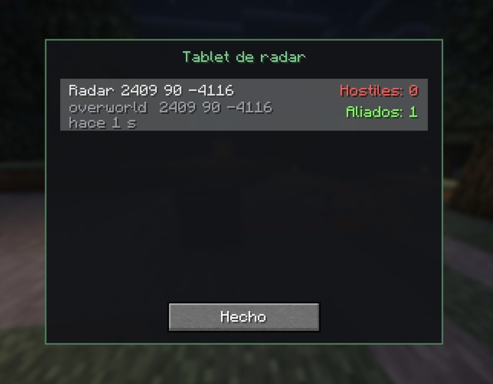

### Radar Transponder

Visually similar to a redstone repeater, but blue and with its own GUI. **It must be placed next to a radar.** From its interface you choose which detections are allowed through:

- Signal generated when an **ally** enters the perimeter.
- Signal generated when an **enemy** enters the perimeter.
- **Both.**

  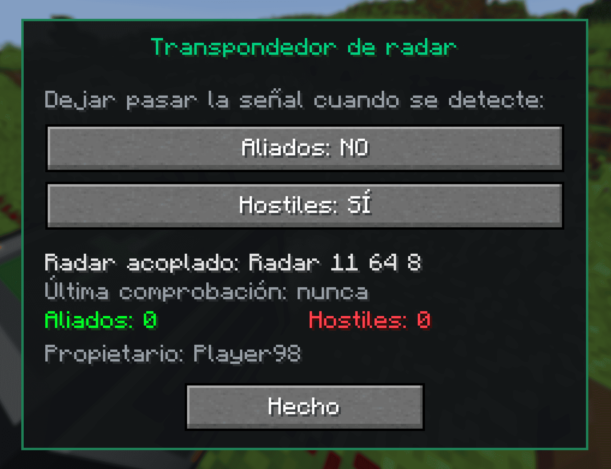

## Crafting recipes

### Radar Antenna

- 6× Copper Ingot (slots 1, 3, 4, 6, 7, 9)
- 2× Redstone Dust (slots 5, 8)
- 1× Tripwire Hook (slot 2)

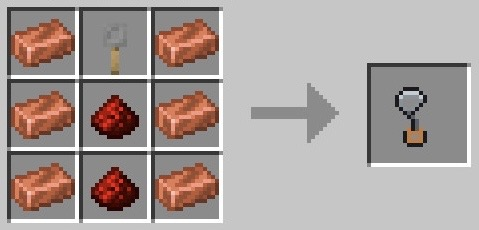

### Radar

- 4× Iron Ingot (slots 1, 3, 4, 6)
- 3× Redstone Block (slots 7, 8, 9)
- 1× Radar Antenna (slot 2)
- 1× Observer (slot 5)

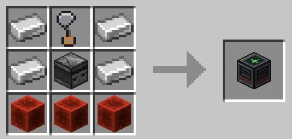

### Radar Tablet

- 6× Iron Nugget (slots 1, 3, 4, 6, 7, 9)
- 1× Redstone Torch (slot 2)
- 1× Diamond (slot 5)
- 1× Copper Ingot (slot 8)

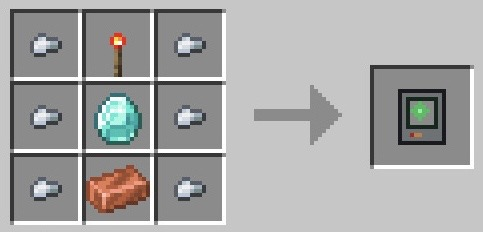

### Radar Transponder

Shapeless — position does not matter.

- 1× Redstone Repeater
- 1× Lapis Lazuli

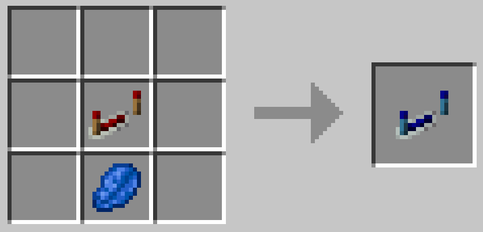

## Languages

-  English
-  Spanish (Español)

Want RadarZone in your language? See [Contributing](#contributing).

## Downloads

Get the **latest stable version**:

You can browse every other version, along with its changelog, on the
**[Releases](../../releases)** section.

## Contributing & Feedback

**Support the project for free by giving it a star rating** ⭐ — it costs nothing
and helps more people find us.

Please **do not use "Issues" or "Pull Requests" sections for feedback**. Feel free to join our
**[Discord server](https://discord.gg/d5y2rQkkb8)** for support, suggestions, bug
reports, contributions...

## Acknowledgements

Thanks to everyone who has helped RadarZone grow — with code, designs, translations, bug
reports, ideas and more. ❤️ This mod would not be the same without them.

  

- [**SrWhiteFox**](https://github.com/SrWhiteFox) — creator of the Mod.

## Sponsors

A special thank you to the people who support the development of RadarZone.
Your backing keeps the mod free, updated and open to everyone.

<!-- 

  

 -->

- **Become the project's first sponsor!**

Want to help? You can donate through **[PayPal](https://paypal.me/samuelrealrguez)**.

### Sponsor perks

-  **Support the development** — your contribution goes straight into keeping RadarZone alive and improving.
-  **Early beta access** — try new projects before anyone else.
-  **Public recognition** — your name and head listed in this Sponsors section.
-  **Exclusive Discord role and badge** — stand out on the [Discord server](https://discord.gg/d5y2rQkkb8).
-  **Personalised help and support** — priority assistance with any question or issue.

## License

This mod is published under a custom licence: **feel free to download, use and share
it, but modification and any kind of sale are not allowed**.

You are authorized to:
- ✅ Use it in singleplayer and on any server, public or private.
- ✅ Redistribute it unmodified, free of charge, with credit and a link back here.
- ✅ Include it in a free modpack.

You are not allowed to:
- ❌ Modify, decompile or publish derivative versions.
- ❌ Sell it, put it behind a paywall, or sell in-game access to its features.
